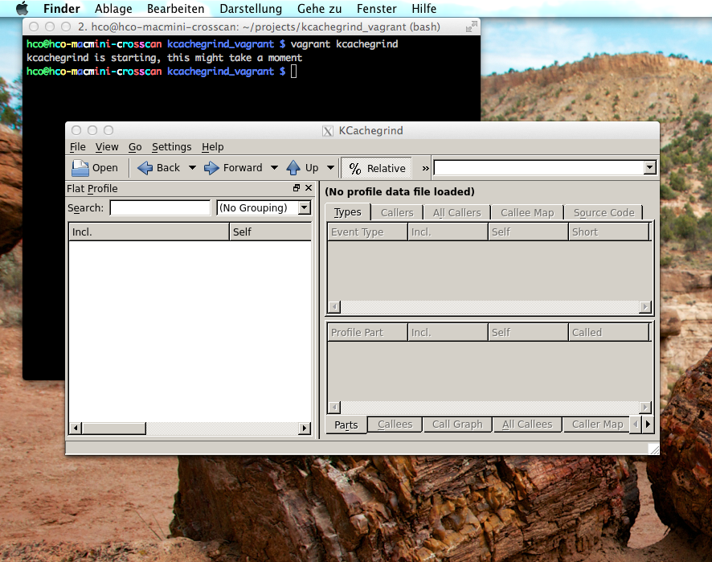

# kcachegrind vagrant vm
This is a little helper if you need to access kcachegrind on mac or windows (not tested, but should work out of the box).
It will create a virtual machine using vagrant. 
Vagrant will install kcachegrind within this virtual machine, and offer a simple command, "vagrant kcachegrind", 
which will start kcachegrind within the virtual machine, but open it's user interface within your mac os gui.

In order to use it, you just need to install vagrant & virtualbox, clone this repository and issue the following commands within the checkout:

```shell
vagrant up
vagrant kcachegrind
```
This will open kcachegrind.

X11 is required on your mac, obviously.

Put your cachegrind files into the cachegrind_files directory, which is shared with the vm.

## Compatibility
Has not yet been tested with vagrant 1.1.
